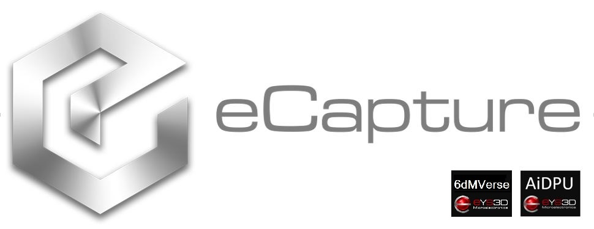
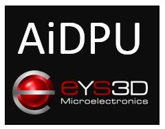
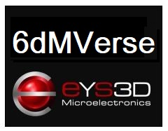

  

-----------------

## Overview
**libeys3d** is a SDK set for eCapture depth cameras .
Bundle project gathers all wrapper and all platform SDK.

## What is included
| What | Description | Download link|
| ------- | ------- | ------- |
| **[eCapture Viewer](./tools)**    | With this application, you can quickly access your eCapture Depth Camera to view the depth stream, visualize point clouds, record and playback streams, configure your camera settings, modify advanced controls, enable depth visualization and post processing  and much more. | [**eCaptureView_Linux**](https://github.com/eYs3D/eCaptureView_Linux/releases) [**eCaptureView_Windows**](https://github.com/eYs3D/eCaptureView_Windows/releases) [**eCaptureView_Android**](https://github.com/eYs3D/eCaptureView_Android/releases)  |
| **[Code Samples](https://github.com/eYs3D/examples)**  |These examples demonstrate how to easily use the SDK to include code snippets that access the camera into your applications. | [**DMPreview_Linux**](https://github.com/eYs3D/HD-DM-Linux-SDK-Release/releases) [**DMPreview_Windows**](https://github.com/eYs3D/HD-DM-Windows-SDK-Release/releases) [**DMPreview_Android**](https://github.com/eYs3D/HD-DM-Android-SDK-Release/releases) |
| **[Wrappers](./wrappers)**  | As well as integration with the following 3rd-party technologies: [ROS], [Python], [Unity], [OpenCV] and more to come. | |
| **[third-party](https://github.com/eYs3D/third-party)**  | Demo 3rd-party integration: [Mediapipe] and more to come. | |

## License
This project is licensed under the [Apache License, Version 2.0](LICENSE).
Copyright 2021 eYs3D Corporation
